#  Deploy & Monitor a Next.js Project on an AWS EC2 

````
by Md Khurshed Alam Nayem
(Batch 7)
(10 November, 2025)
````

*   EC2 Setup
    -   EC2 Region in Mumbai
        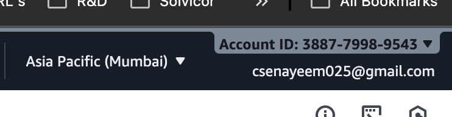
    -   EC2 instance tag name "nayem-ec2-module3"
        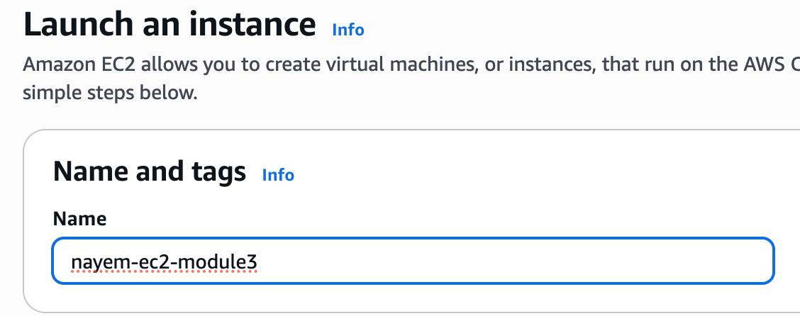
    -   create key pair as RSA type generated which is "nayem-module3"
        
    -   OS Ubuntu
        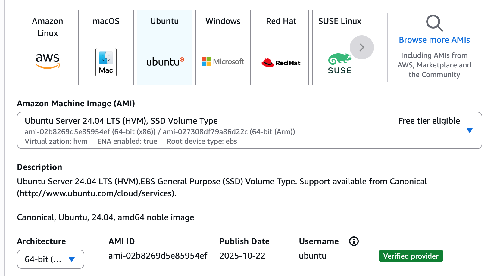
    -   set security group where SSH allowed only
        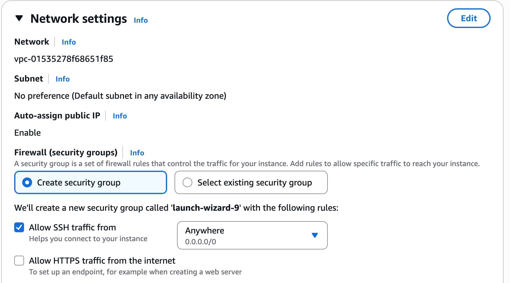
    -   set 30GB storage
        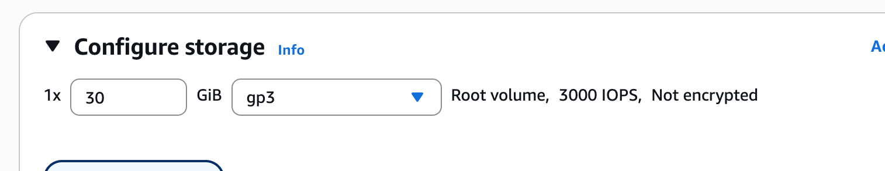
    -   assign instance 1 & launch
        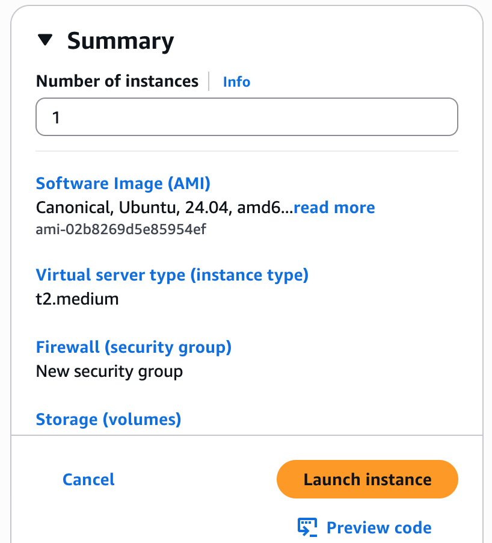
    -   connect EC2 instance
        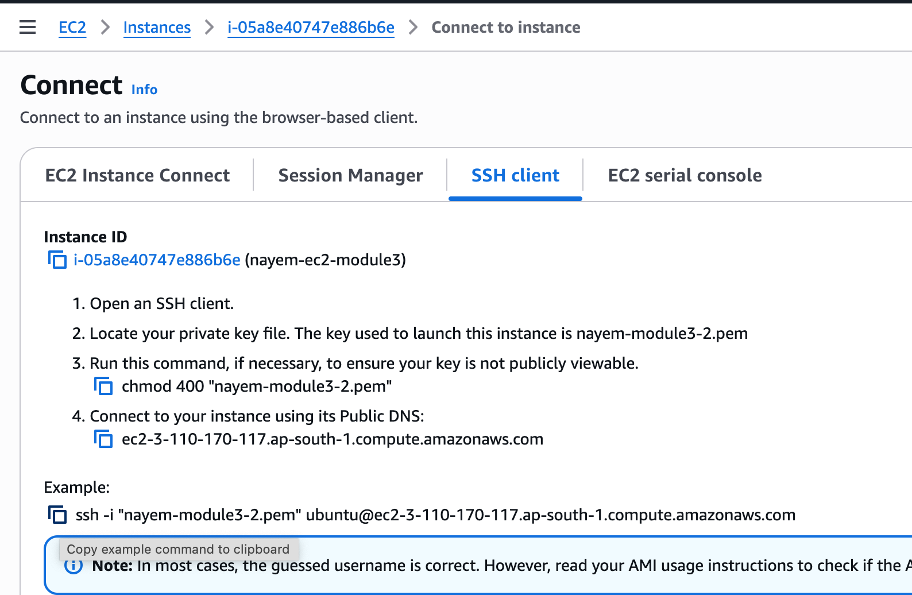
*   Environment Setup
    -   from my Mac Terminal
        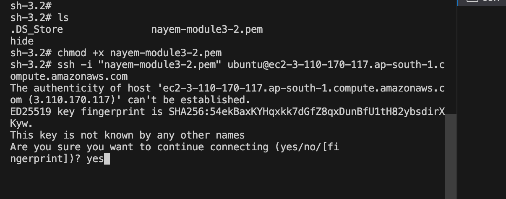
    -   run sudo apt update
        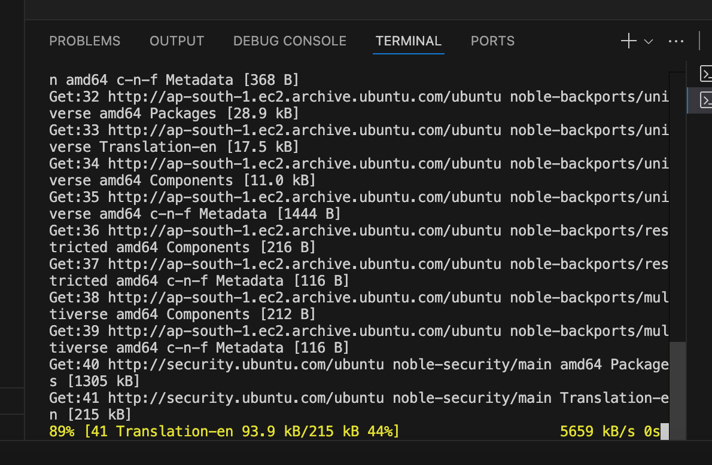
    -   run sudo su & apt install nodejs npm
        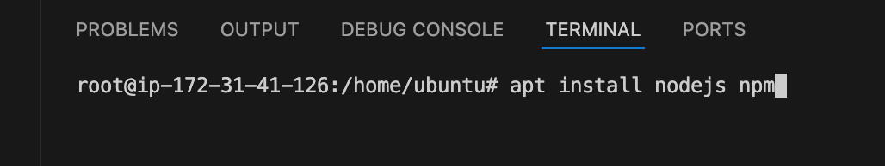
    -   check versions
        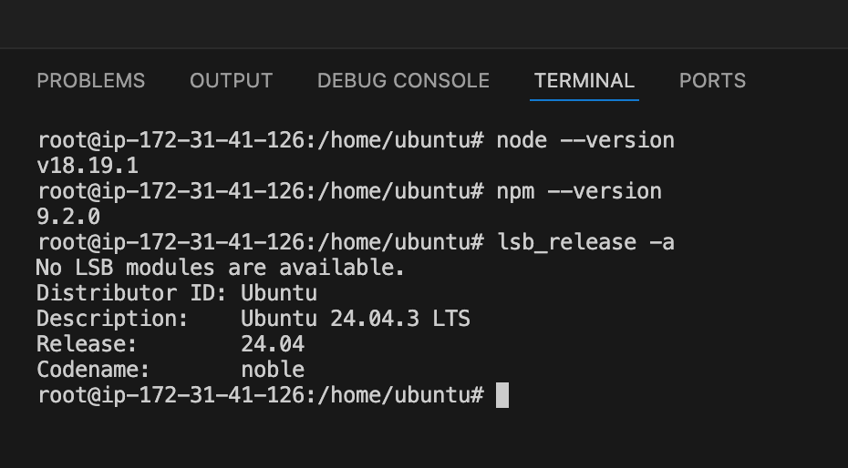
    -   git clone https://github.com/mdarifahammedreza/next-japan.git
        -   I got a folder as next-japan
        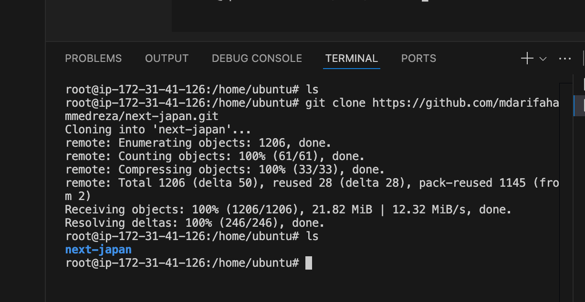
    -   Install PM2 globally
        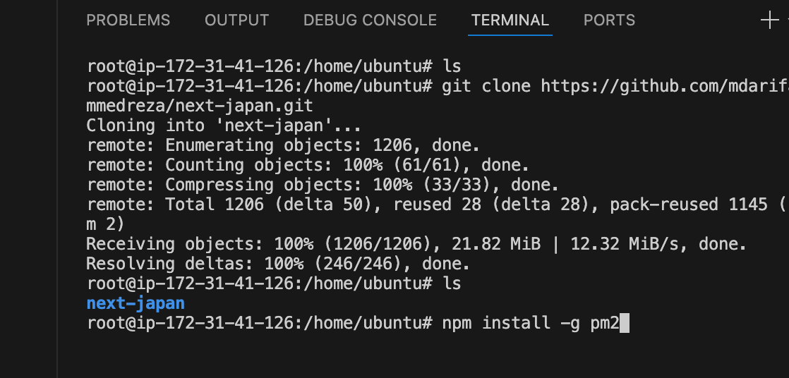
*   Project Deploymen
    -   Install project dependencies using npm install
        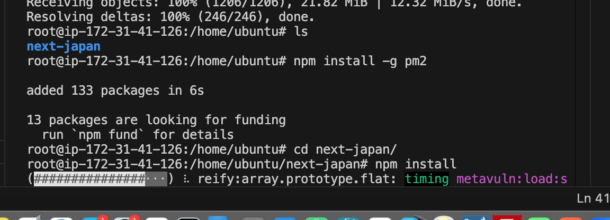
    -   EC2 security group update
        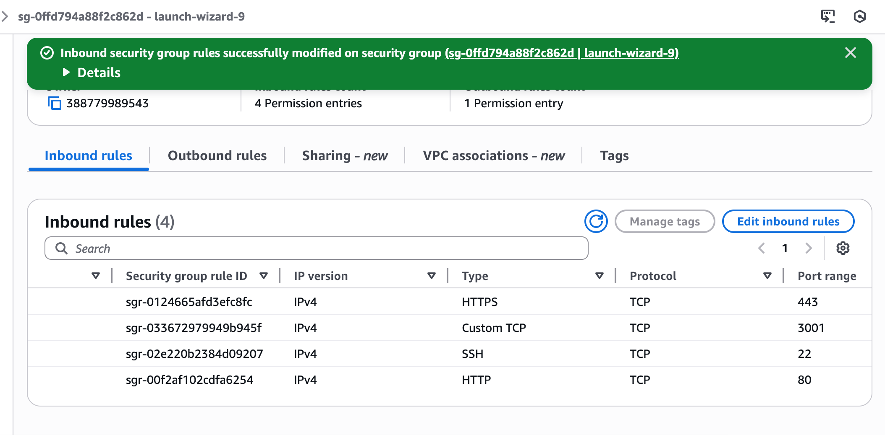
    -   PORT=3001 pm2 start npm --name "ec2-nextjs" -- run prod
        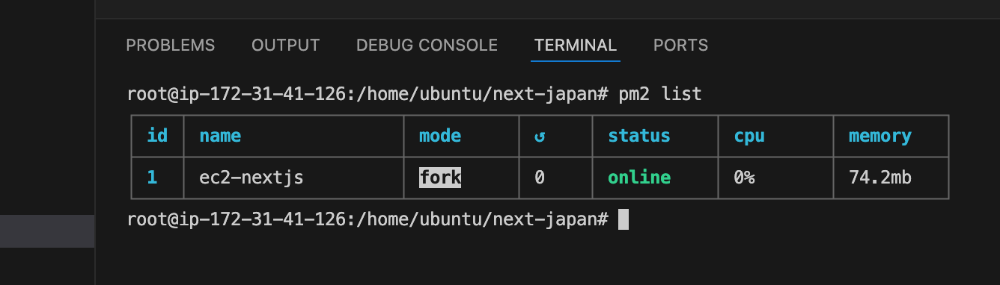
    -   project running on http://3.110.170.117:3001
        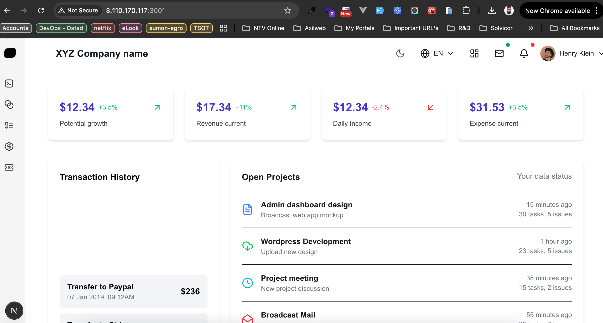
*   Monitoring and Management
    -   pm2 list
        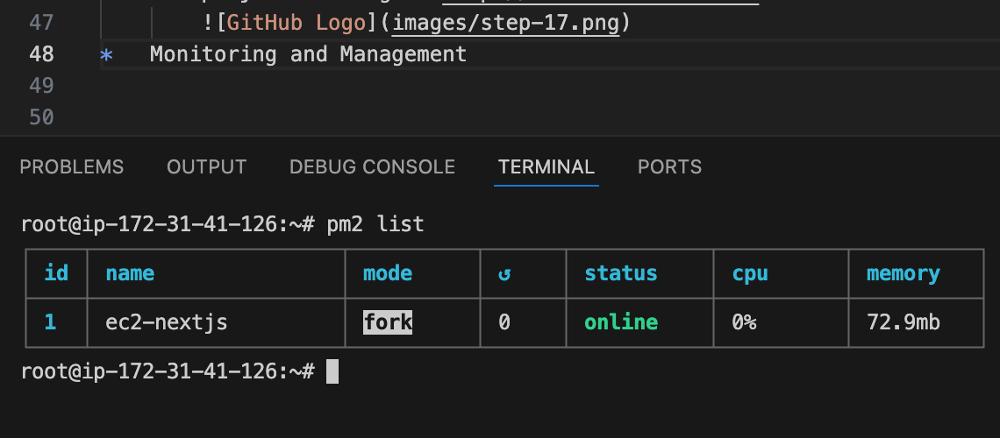
    -   pm2 logs
        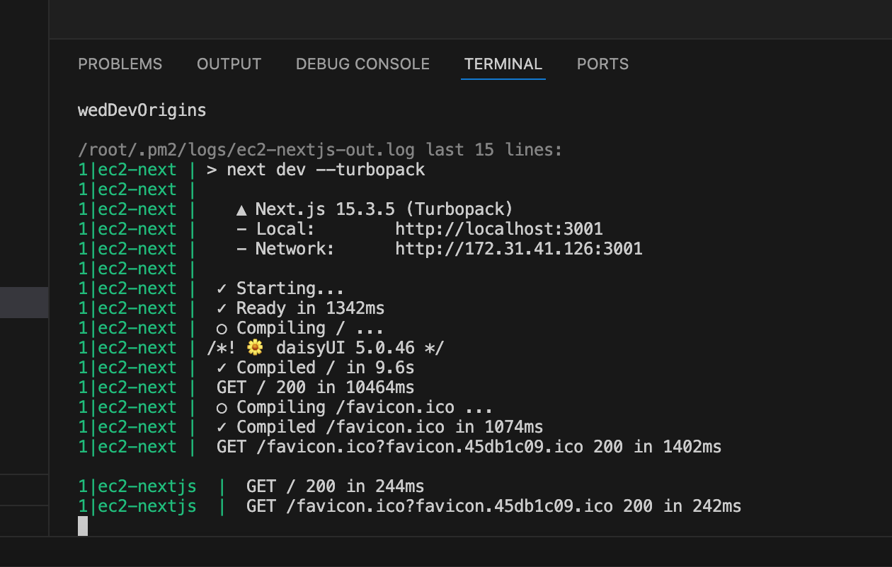
    -   pm2 monit
        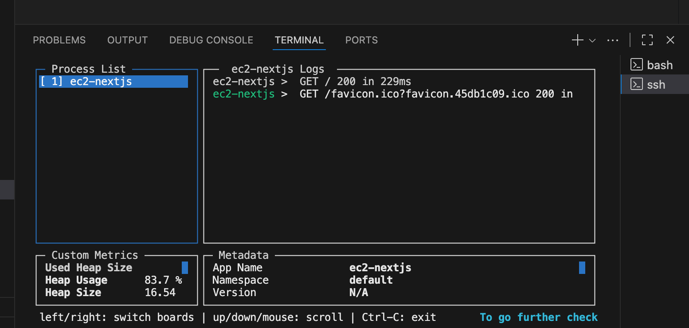
    -   Set up PM2 to automatically start the project on server reboot(pm2 startup)
        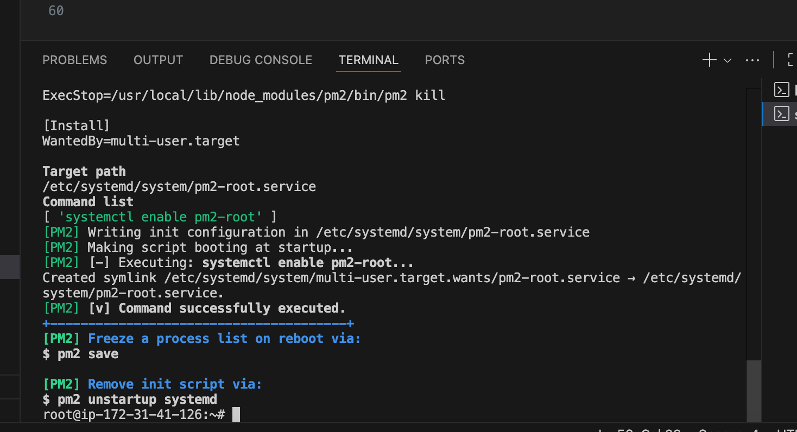


